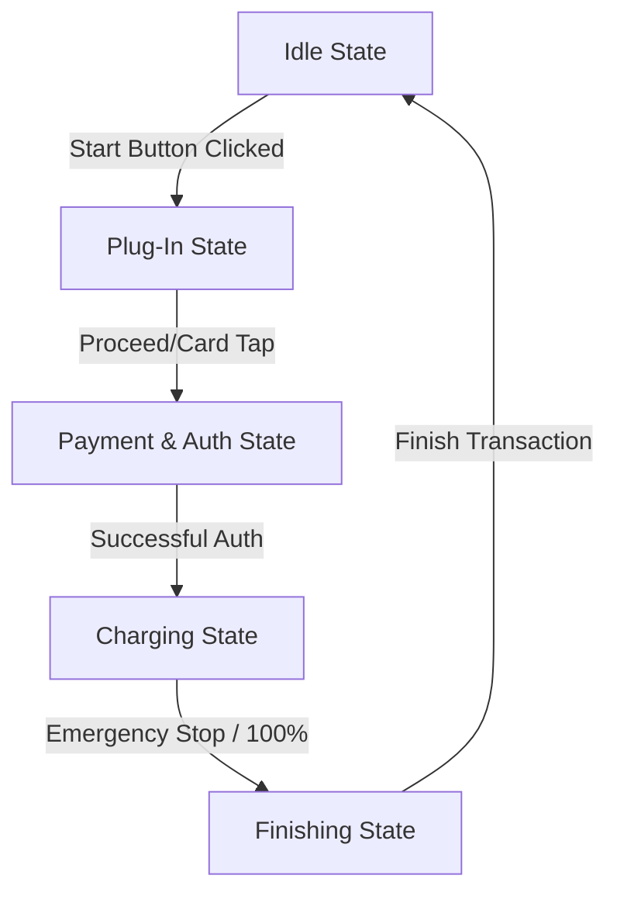

# VOLTCORE — Premium EV Kiosk User Interface & Simulation Engine

VOLTCORE is a state-of-the-art, high-performance Electric Vehicle (EV) charging kiosk user interface designed for 1024x768 display systems. It features a futuristic dark-mode theme, glassmorphic styling, rich animations, native video integration, and an interactive simulation dashboard.

Built entirely in Python using the **PyQt6** framework, the UI provides a production-grade experience with dual-language support, real-time status telemetry, and full configuration capabilities.

---

## 📸 Interactive States & Flow

The application manages the charging lifecycle using a stack-based layout architecture via `QStackedWidget`. The states flow as follows:



### 1. Idle State (`pages/idle_state.py`)
*   **Hero Card**: Prominent interactive zone featuring a dynamic video background looping high-definition EV visual previews. Includes language toggle switches and the main "TAP TO START" interactive trigger.
*   **Active Telemetry Bento Grid**:
    *   **Last Transaction Card**: Real-time receipt detailing the timestamp, final State of Charge (SoC), energy delivered, elapsed time, and total cost of the previous session.
    *   **Live Updates Feed**: Vertical scrolling event list logging simulator notifications (e.g. system status changes, queue revisions, reservation alerts) with distinct color coding.
    *   **Weather Widget**: Dynamic localized weather statistics featuring localized translation keys.

### 2. Plug-In State (`pages/plug_in_state.py`)
*   **Visual Instruction**: An in-app looping HD instructional video demonstrating correct socket alignment and plug insertion.
*   **Status Callouts**: Clear, glowing warning cues and action cards guiding the user step-by-step.
*   **Manual Override**: An "Action Button" enabling testing and immediate transition to the authentication screen.

### 3. Payment & Authentication State (`pages/payment_state.py`)
*   **Dual-Method Authorization**: Supports both contactless RFID card tapping and QR code scan simulation.
*   **Interactive Simulation Animations**: Tap-detection animation triggers a status-shifting event, automatically carrying the user to the charging process.

### 4. Active Charging State (`pages/charging_state.py`)
*   **Circular Charging Gauge**: Built using custom drawing operations (`paintEvent` on a custom canvas), featuring:
    *   Dynamic percentage numeric display.
    *   Real-time charging rate output (kW) with simulated stochastic fluctuation within ±0.5% of the configured limit.
    *   Glow animations synchronized with the power cycle.
*   **Live Counter Cards**: Trackers for elapsed time, accumulated energy (kWh) computed via integration steps, and an estimated time of completion based on current charging speeds.
*   **Emergency Stop**: An absolute safety override allowing manual completion of the charging process at any point.

### 5. Finishing State (`pages/finishing_state.py`)
*   **Bento Receipt Grid**: Sums up all key metrics of the completed session: total duration, final energy output, carbon footprint reduction (CO₂ saved), and final cost calculation.
*   **Eco Graph**: A custom-drawn vector line graph rendering charging efficiency trends with a neon-green glowing curve.
*   **Return to Idle**: Clicking "Finish" commits the current transaction data as the new "Last Transaction" on the idle page and resets Kiosk telemetry.

---

## 🎛️ Advanced Kiosk & Simulator Control Panel

VOLTCORE features an administrative control dashboard accessible by clicking the **Settings** button in the bottom left corner. This panel functions both as a hardware simulator control and as a kiosk config editor.

### Settings & Simulator Options

| Parameter | Type | Default | Description |
| :--- | :--- | :--- | :--- |
| **Station ID** | String | `4882-X` | The unique identifier of the kiosk. Updates the sidebar brand panel dynamically. |
| **Max Power Limit** | SpinBox | `350 kW` | Configures the maximum charging rate. The active charging page will dynamically simulate a fluctuating charge rate centered around this value. |
| **Price / kWh** | SpinBox | `Rp 2.500` | The tariff coefficient in Indonesian Rupiah. Dynamically calculates active charging costs and the final receipt. |
| **Charger Status** | ComboBox | `Available` | Overrides the current state machine status (`Available`, `Preparing`, `Charging`, `Finishing`, `Reserved`, `Scheduled`, `Faulted`). |
| **Waiting Queue** | CheckBox | `False` | Enables/Disables the waiting list statistics block. |
| **Waiting Users** | SpinBox | `0` | The number of simulated users currently in the charging queue. |
| **Estimated Wait** | SpinBox | `0 mins` | The queue timeout estimation displayed on the sidebar. |
| **Reservation Details**| LineEdits | `None` | Overrides the reservation queue's active user and schedule slot. |

---

## 🛠️ Technology Stack & Dependencies

*   **Language**: Python 3.10+
*   **UI Framework**: PyQt6 (core widgets, layouts, style sheets, and vector graphics canvas)
*   **Multimedia Integration**: QtMultimedia (FFmpeg backend for cross-platform hardware-accelerated video decoding)
*   **Styling**: Pure CSS-like QSS (Qt Style Sheets) styled using custom modern dark-mode palettes (e.g. `#0b1326`, `#00f0ff`, `#4edea3`).
*   **Fonts**: Native loading of Space Grotesk, Plus Jakarta Sans, and Inter fonts.

---

## 📦 Installation & Execution

### 1. Pre-requisites
Ensure Python 3.10 or higher is installed. Additionally, because the UI displays high-definition instruction videos, **FFmpeg** is required as the multimedia decoding backend.

#### Install FFmpeg:
*   **Windows**:
    ```powershell
    winget install Gyan.FFmpeg
    ```
*   **macOS**:
    ```bash
    brew install ffmpeg
    ```
*   **Linux (Ubuntu/Debian)**:
    ```bash
    sudo apt update
    sudo apt install ffmpeg
    ```

### 2. Clone the Repository
```bash
git clone <your-repository-url>
cd isi_bensin_rev
```

### 3. Install Python Dependencies
```bash
pip install -r requirements.txt
```

### 4. Run the Application
```bash
python main.py
```

---

## 📂 File Architecture

```text
├── config.py             # Configures global path constants (fonts, icons, video assets)
├── main.py               # Application entry point. Loads splash screen and launches main window
├── requirements.txt      # PyPI packages mapping dependencies
├── .gitignore            # Git filter rules
├── pages/                # Individual stacked layout screens
│   ├── idle_state.py     # Hero panel, event ticker, weather widget
│   ├── plug_in_state.py  # Instructional video overlay for connector insertion
│   ├── payment_state.py  # Simulation interface for RFID and QR validation
│   ├── charging_state.py # Custom vector dial gauge, timer calculations, power simulations
│   └── finishing_state.py# Eco-analytics receipt bento grid, vector line efficiency graph
├── ui/                   # System design, core components, global dialogs
│   ├── main_window.py    # Main window framework, event router, state machine
│   ├── settings_dialog.py# Administrative control panel and kiosk parameter editor
│   ├── splash_screen.py  # Animated boot-up splash screen
│   └── widgets/
│       ├── bouncing_tooltip.py # Animated dynamic instructions
│       └── sidebar.py    # Interactive station telemetry sidebar, language toggles, state indicators
└── resources/            # Brand resources (fonts, custom icons, motion videos)
```

---

## 📝 License

Distributed under the MIT License. See `LICENSE` for more information.
